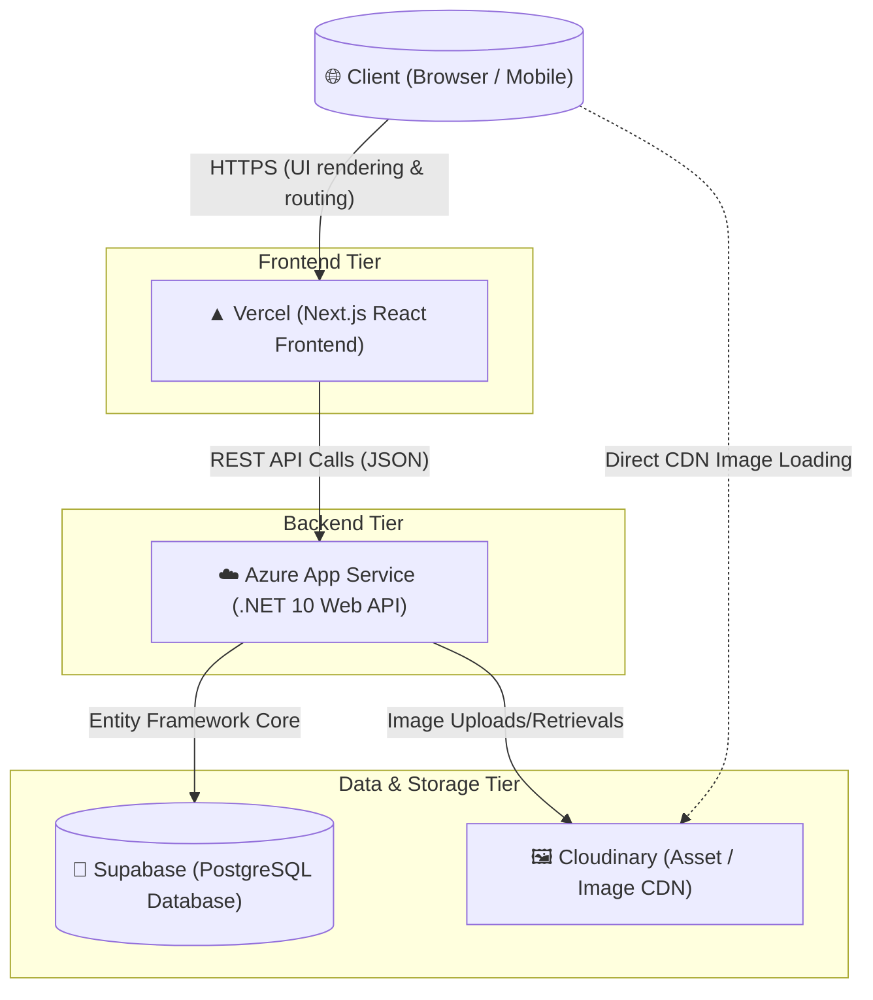
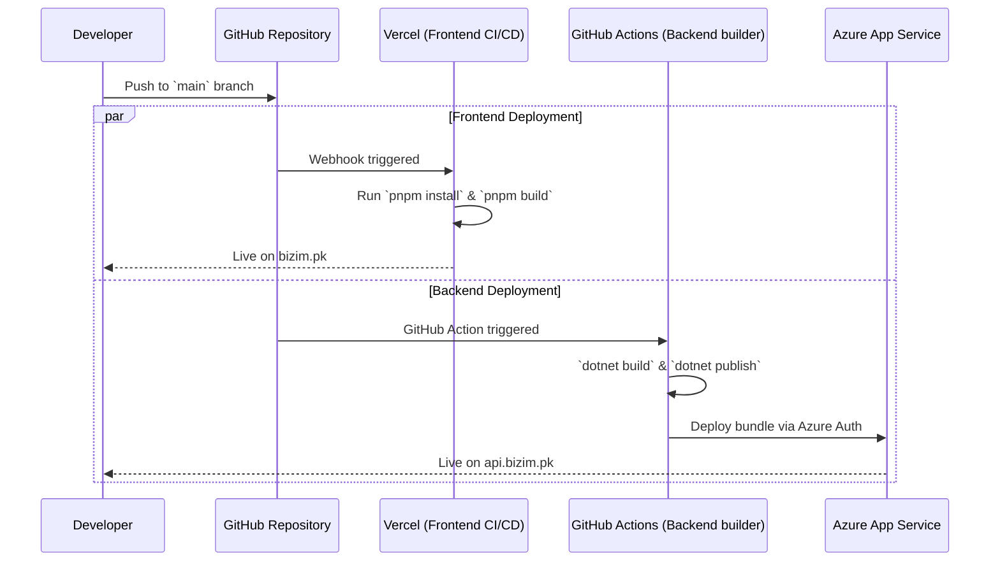
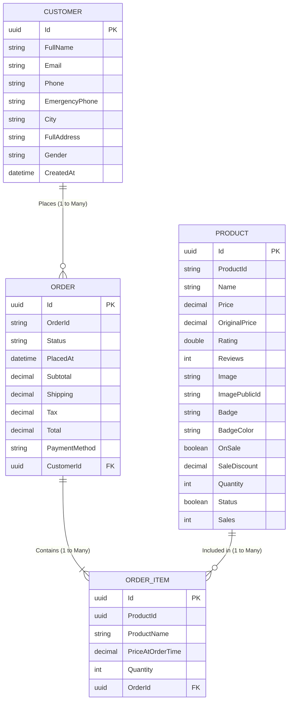

# Bizim.pk - System Architecture & Database Design

## 1. High-Level System Architecture

Bizim.pk is built using a modern, decoupled Headless E-commerce architecture. The separation of the frontend (Next.js) from the backend (.NET Web API) allows for ultimate scalability, better security, and flexibility (e.g., easily building a native Mobile App in the future).

### Architecture Components
*   **Frontend (Vercel):** Next.js App Router providing Server-Side Rendering (SSR) for blazing fast SEO, utilizing Tailwind CSS and Shadcn UI components for styling.
*   **Backend API (Azure App Service):** An ASP.NET Core 10 Web API. It acts as the gatekeeper, processing business logic, handling checkout sessions, and safely modifying database records.
*   **Database (Supabase):** Managed PostgreSQL database. Connected to the backend via Entity Framework Core (ORM).
*   **Media Storage (Cloudinary):** A dedicated CDN used to store product images. This prevents massive database bloat and serves images much faster globally.

---

## 2. CI/CD Deployment Flow

The system employs Continuous Integration and Continuous Deployment (CI/CD) to ensure changes are deployed automatically inside safe environments.

---

## 3. Entity Relationship Diagram (Database Schema)

The PostgreSQL database uses the following relational footprint. The structure maintains data integrity by snapping historical prices inside `OrderItems` rather than relying on live prices that might change. 

### Table Descriptions
*   `Customers`: Contains demographic and contact data. This data is attached to orders.
*   `Orders`: A master record of a checkout instance. Tracks financial sum totals, lifecycle status (Pending, Shipped), and links back to the individual customer.
*   `Order_Items`: The bridge table. When an order is placed, an `OrderItem` is created for every product. Crucially, it locks in `PriceAtOrderTime` so financial records remain accurate even if the store admin changes product prices later.
*   `Products`: The master inventory table. Tracks available stock (`Quantity`), marketing flags (`OnSale`, `Badge`), and links directly to the `Cloudinary` image.